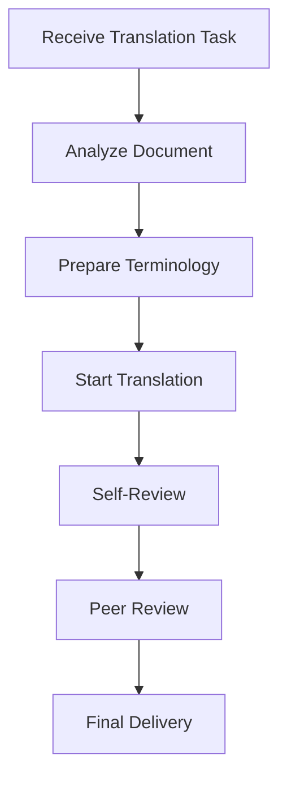

# Getting Started

This guide will help you quickly get started with technical translation, from preparation to completing your first translation project.

## Preparation

### 1. Environment Setup

#### Essential Tools
- **Text Editor**: VS Code, Sublime Text, or other multi-language editors
- **CAT Tools**: Trados, MemoQ, or free OmegaT
- **Terminology Management**: Excel, Google Sheets, or professional terminology management software
- **Version Control**: Git (for collaborative translation projects)

#### Recommended Plugins
- **VS Code Extensions**:
  - Chinese (Simplified) Language Pack
  - Markdown All in One
  - GitLens
  - Code Spell Checker

### 2. Establish Workflow



## Your First Translation Project

### Step 1: Document Analysis

Before starting translation, conduct a comprehensive analysis of the source document:

- **Document Type**: API documentation, user manual, technical blog, etc.
- **Target Audience**: Developers, end users, technical support, etc.
- **Technical Domain**: Frontend, backend, mobile development, AI, etc.
- **Document Length**: Estimate translation workload
- **Special Requirements**: Format, terminology, deadline, etc.

### Step 2: Terminology Preparation

Create a project terminology table:

| English Term | Chinese Translation | Notes |
|-------------|-------------------|-------|
| API | 应用程序接口 | Keep original, don't translate |
| Framework | 框架 | |
| Library | 库 | |
| Component | 组件 | |
| Authentication | 身份验证 | |

### Step 3: Translation Practice

#### Example: API Documentation Translation

**Original**:
```markdown
## Authentication

This API uses API key authentication. Include your API key in the header of each request:

```http
GET /api/users
Authorization: Bearer YOUR_API_KEY
```

**Translation**:
```markdown
## 身份验证

此 API 使用 API 密钥身份验证。请在每个请求的头部包含您的 API 密钥：

```http
GET /api/users
Authorization: Bearer YOUR_API_KEY
```

#### Translation Key Points

1. **Keep Code Unchanged**: HTTP requests, code examples, etc. remain as is
2. **Terminology Consistency**: Maintain consistent translation of the same term throughout the document
3. **Natural Language**: Conform to Chinese expression habits
4. **Format Preservation**: Maintain the structure and format of the original document

### Step 4: Quality Check

#### Self-Check Checklist

- [ ] Is terminology translation consistent?
- [ ] Are code and commands kept unchanged?
- [ ] Is the format correct?
- [ ] Is the language natural and fluent?
- [ ] Are technical concepts accurate?
- [ ] Are links and references correct?

#### Common Mistakes

1. **Inconsistent Terminology**
   - ❌ Wrong: "component" sometimes translated as "组件", sometimes as "部件" in the same document
   - ✅ Correct: Consistently use "组件"

2. **Code Being Translated**
   - ❌ Wrong: `getUserInfo()` translated as `获取用户信息()`
   - ✅ Correct: Keep `getUserInfo()` unchanged

3. **Format Destruction**
   - ❌ Wrong: Breaking Markdown table format
   - ✅ Correct: Maintain original table structure

## Advanced Tips

### 1. Build Personal Terminology Database

Use tools like Notion, Obsidian, or simple Excel sheets to maintain your personal terminology database:

```markdown
# My Technical Terminology Database

## Frontend Development
- Component: 组件
- Hook: 钩子
- State: 状态
- Props: 属性

## Backend Development
- Middleware: 中间件
- Endpoint: 端点
- Database: 数据库
```

### 2. Use Translation Memory

For repetitive content, building a translation memory database can greatly improve efficiency:

- Save translations of common sentence patterns
- Record translations of standard warnings and prompts
- Build translated versions of template documents

### 3. Collaborative Translation

In team projects:

- Use Git for version control
- Build team terminology database
- Conduct regular peer reviews
- Use collaboration platforms like Crowdin, Lokalise

## Next Steps

Congratulations! You have completed your first translation project. Next, you can:

- Learn more [Translation Standards](/en/standards/)
- Explore professional [Translation Tools](/en/tools/)
- Join translation communities to exchange experiences with other translators

## FAQ

### Q: What to do when encountering uncertain terminology?
A: 
1. Check the Chinese version of official documentation
2. Search for the usage of this term in relevant technical communities
3. Consult technical experts
4. Mark uncertain parts in translation for unified handling later

### Q: How to handle newly emerged technical terms?
A:
1. First check if there's an official Chinese translation
2. Refer to industry standard translations
3. If there's no standard translation, keep the English original
4. Record the decision and reasoning in the terminology table

### Q: How to improve translation speed?
A:
1. Become proficient with CAT tools
2. Build a comprehensive terminology database
3. Use translation memory features
4. Develop professional knowledge in specific fields
5. Practice speed reading and comprehension skills