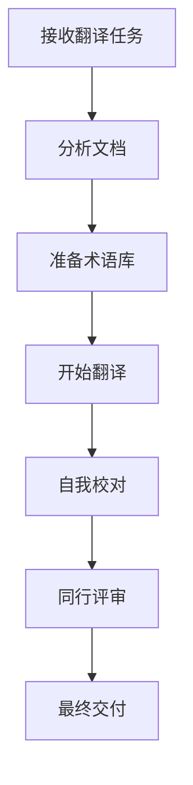

# 快速开始

本指南将帮助您快速上手技术翻译，从准备工作到完成第一个翻译项目。

## 前期准备

### 1. 环境搭建

#### 必备工具
- **文本编辑器**: VS Code、Sublime Text 或其他支持多语言的编辑器
- **CAT工具**: Trados、MemoQ 或免费的 OmegaT
- **术语管理**: Excel、Google Sheets 或专业术语管理软件
- **版本控制**: Git（用于协作翻译项目）

#### 推荐插件
- **VS Code插件**:
  - Chinese (Simplified) Language Pack
  - Markdown All in One
  - GitLens
  - Code Spell Checker

### 2. 建立工作流程



## 第一个翻译项目

### 步骤1: 文档分析

在开始翻译之前，需要对源文档进行全面分析：

- **文档类型**: API文档、用户手册、技术博客等
- **目标受众**: 开发者、最终用户、技术支持等
- **技术领域**: 前端、后端、移动开发、AI等
- **文档长度**: 估算翻译工作量
- **特殊要求**: 格式、术语、截止日期等

### 步骤2: 术语准备

创建项目术语表：

| 英文术语 | 中文翻译 | 备注 |
|---------|---------|------|
| API | 应用程序接口 | 不翻译，保持原文 |
| Framework | 框架 | |
| Library | 库 | |
| Component | 组件 | |
| Authentication | 身份验证 | |

### 步骤3: 翻译实践

#### 示例：API文档翻译

**原文**:
```markdown
## Authentication

This API uses API key authentication. Include your API key in the header of each request:

```http
GET /api/users
Authorization: Bearer YOUR_API_KEY
```

**译文**:
```markdown
## 身份验证

此 API 使用 API 密钥身份验证。请在每个请求的头部包含您的 API 密钥：

```http
GET /api/users
Authorization: Bearer YOUR_API_KEY
```

#### 翻译要点

1. **保持代码不变**: HTTP 请求、代码示例等保持原样
2. **术语一致性**: 同一术语在整个文档中保持一致翻译
3. **语言自然**: 符合中文表达习惯
4. **格式保持**: 保持原文档的结构和格式

### 步骤4: 质量检查

#### 自检清单

- [ ] 术语翻译是否一致？
- [ ] 代码和命令是否保持原样？
- [ ] 格式是否正确？
- [ ] 语言是否自然流畅？
- [ ] 技术概念是否准确？
- [ ] 链接和引用是否正确？

#### 常见错误

1. **术语不一致**
   - ❌ 错误：同一文档中 "component" 有时翻译为"组件"，有时为"部件"
   - ✅ 正确：统一使用"组件"

2. **代码被翻译**
   - ❌ 错误：`getUserInfo()` 翻译为 `获取用户信息()`
   - ✅ 正确：保持 `getUserInfo()` 不变

3. **格式破坏**
   - ❌ 错误：破坏了 Markdown 的表格格式
   - ✅ 正确：保持原有的表格结构

## 进阶技巧

### 1. 建立个人术语库

使用工具如 Notion、Obsidian 或简单的 Excel 表格来维护个人术语库：

```markdown
# 我的技术术语库

## 前端开发
- Component: 组件
- Hook: 钩子
- State: 状态
- Props: 属性

## 后端开发
- Middleware: 中间件
- Endpoint: 端点
- Database: 数据库
```

### 2. 使用翻译记忆

对于重复性内容，建立翻译记忆库可以大大提高效率：

- 保存常用句式的翻译
- 记录标准警告和提示的翻译
- 建立模板文档的翻译版本

### 3. 协作翻译

在团队项目中：

- 使用 Git 进行版本控制
- 建立团队术语库
- 定期进行同行评审
- 使用协作平台如 Crowdin、Lokalise

## 下一步

恭喜！您已经完成了第一个翻译项目。接下来可以：

- 学习更多[翻译规范](/standards/)
- 探索专业[翻译工具](/tools/)
- 加入翻译社区，与其他译者交流经验

## 常见问题

### Q: 遇到不确定的术语怎么办？
A: 
1. 查阅官方文档的中文版本
2. 搜索该术语在相关技术社区的使用情况
3. 咨询技术专家
4. 在翻译中标注不确定的地方，后续统一处理

### Q: 如何处理新出现的技术术语？
A:
1. 优先查看是否有官方中文翻译
2. 参考行业标准翻译
3. 如果没有标准翻译，可以保留英文原文
4. 在术语表中记录决定和理由

### Q: 翻译速度如何提高？
A:
1. 熟练使用 CAT 工具
2. 建立完善的术语库
3. 使用翻译记忆功能
4. 培养对特定领域的专业知识
5. 练习快速阅读和理解能力