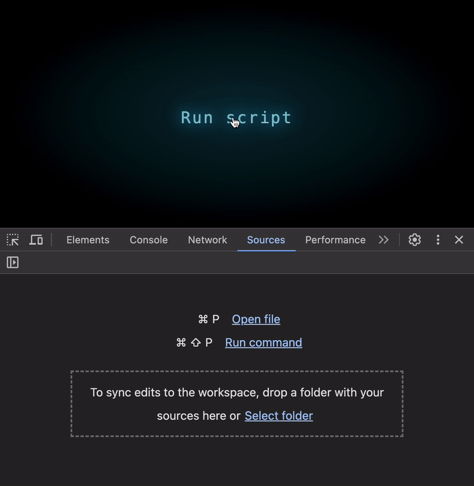
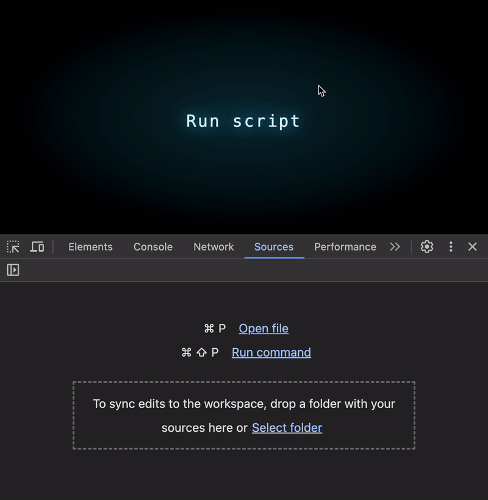
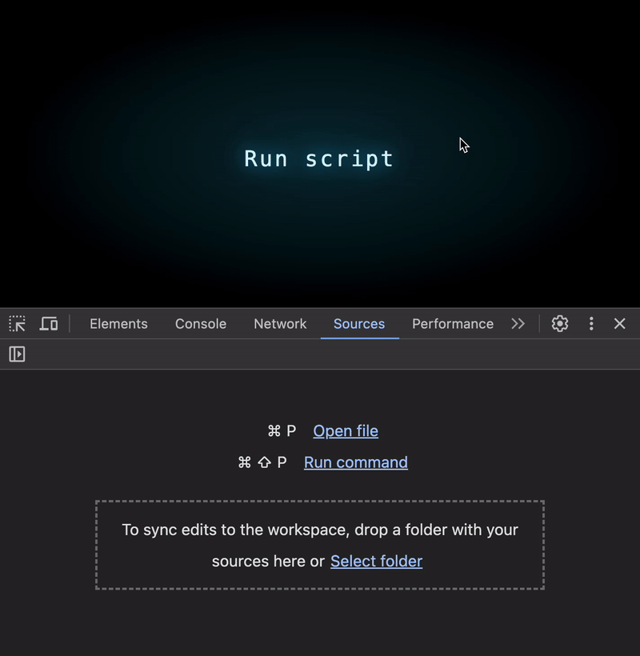
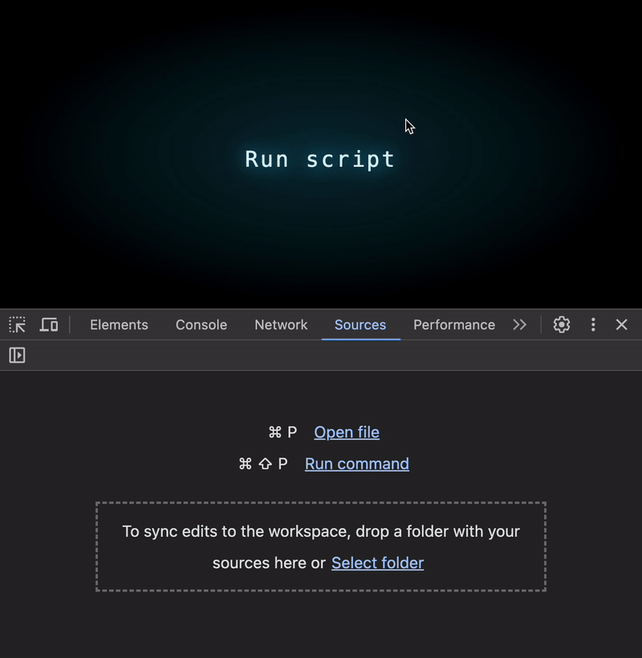

# JS Perf #1: The Hidden Cost of Arrays

Have you ever dreamed of improving your code’s performance in just one click?


Take a look at this code:

```js
const source = [1, 2, 3];
const target = [4, 5, 6];

function isIntersect() {
  return source.some(item => target.includes(item));
}
```

Does anything seem off? Can you spot any potential issues?

At first glance, this code looks perfectly fine. It checks if at least one item in the source array exists in the target array. It's concise, leverages JavaScript's built-in API, and seems like a great solution 🚀

But is it really as efficient as it looks?

---

## What Happens When the Data Grows?

Let’s expand the example to larger arrays:



Run it, and everything still works quickly 💪 No red flags, right?

But what if we scale it further?

---

## What Happens When the Data Grows Even More?

Let’s crank things up. How about arrays with 60,000 elements?


😱 The execution time skyrockets! For arrays this large, the code can take several seconds to run — an eternity in computing terms.

What’s going on? Let’s break it down.

---

## The Problem

The culprit lies in the nested operations:

- Array.includes performs a linear search = O(n).
- Array.some iterates through the source array = O(m).
  
Combined, this gives us an overall complexity of O(n * m) — a disaster for large datasets 🥵

## The Solution: Optimized Data Structures

To fix this, we can transform the target array into a structure that allows constant-time lookups, i.e. O(1). Here’s one simple approach using an array as an index:

```js
function isIntersect() {
    const arr = [];
    target.forEach(item => arr[item] = null);
    return source.some(item => item in arr);
}
```



Wow! Even for 120K elements, the execution time is negligible 🥳

## Why Does This Work?

The magic lies in leveraging constant-time lookups with indexed structures. Here are a few alternative implementations using other data structures:

### Using an object:

```js
function isIntersect() {
    const obj = {};
    target.forEach(item => obj[item] = null);
    return source.some(item => item in obj);
}
```



### Using a Map:

```js
function isIntersect() {
    const entries = target.map(item => [item]);
    const map = new Map(entries);
    return source.some(item => map.has(item));
}
```


### Using a Set (the best option):

```js
function isIntersect() {
  const set = new Set(target);
  return source.some(item => set.has(item));
}
```



All these options share the same efficient complexity of O(1) for lookups, making them far superior to the original approach.

## Comparing the Complexity

### Original Approach:

- Time Complexity: O(n * m)
- Space Complexity: O(n + m)

### Optimized Approach:

- Time Complexity: O(n + m)
- Space Complexity: O(k), where k is the range of values in target.

While the indexed array is memory-efficient for small, dense ranges, a Set is more versatile and better suited for general cases.

## Conclusion

Switching from Array.includes to a more appropriate data structure like Set or an indexed array can drastically improve performance — especially when working with large datasets.

What might seem like an innocent line of code can hide inefficiencies that scale poorly. Understanding JavaScript’s inner workings enables you to write not only correct but also highly efficient code.


## Original Text

[JS Perf #1: The Hidden Cost of Arrays](https://itnext.io/the-hidden-cost-of-js-arrays-ae39b5356e52)