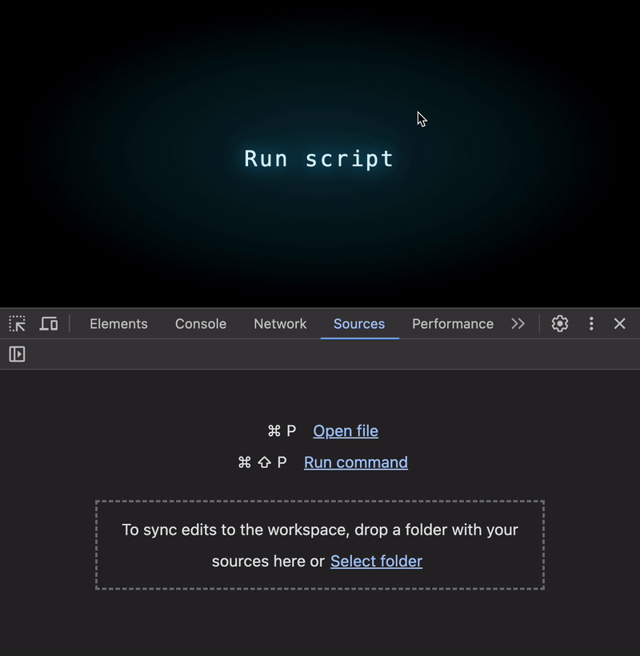
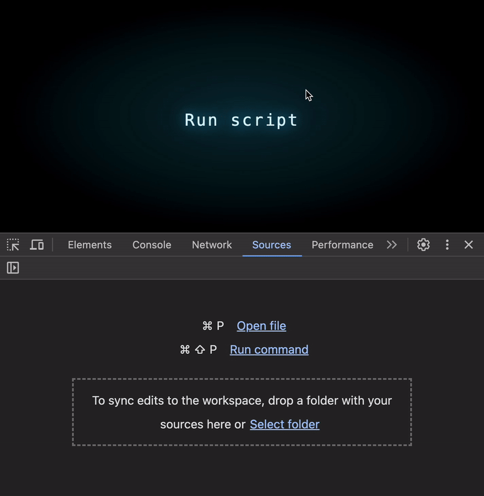

# JS性能优化<1>：数组操作的隐性成本

您是否想过只需点击一下就能提升代码性能？


请看这段代码：

```js
const source = [1, 2, 3];
const target = [4, 5, 6];

function isIntersect() {
  return source.some(item => target.includes(item));
}
```

您发现其中的问题了吗？

乍看之下这段代码很标准：它检查源数组(source)中是否至少有一个元素存在于目标数组(target)中，充分利用JavaScript原生API，是个优雅的解决方案 🚀

但它的性能真的与外观一样完美吗？


## 数据规模增大时会发生什么？

我们尝试扩展数据量：


运行结果显示处理速度依然很快 💪 看似没有问题对吗？

但如果进一步扩大数据规模呢？


## 当数据规模进一步扩大时会发生什么？

我们将数组长度扩大到6万元素级别：


😱 执行时间开始急剧攀升！对于这类规模的数据，代码执行可能需要数秒时间——这在计算领域堪称性能灾难。

让我们深入分析根本原因

## 问题定位

性能瓶颈源自嵌套操作：

* Array.includes执行线性搜索 ⇒ 时间复杂度O(n)
* Array.some遍历源数组 ⇒ 时间复杂度O(m)

组合使用时总体时间复杂度达到O(n*m) —— 大数据场景的致命缺陷 🥵

## 优化方案：改进数据结构

解决思路是将目标数组转换为支持O(1)查询的数据结构。以下是一个基于数组索引的优化示例：

```js
function isIntersect() {
    const arr = [];
    target.forEach(item => arr[item] = null);
    return source.some(item => item in arr);
}
```



效果惊人！即使处理12万元素级数据，执行时间仍然可忽略不计！🥳

## 原理剖析

这种优化的核心在于通过索引结构实现O(1)查询。以下演示其他数据结构方案：

### 使用对象存储：

```js
function isIntersect() {
    const obj = {};
    target.forEach(item => obj[item] = null);
    return source.some(item => item in obj);
}
```


### 使用映射(Map)：

```js
function isIntersect() {
    const entries = target.map(item => [item]);
    const map = new Map(entries);
    return source.some(item => map.has(item));
}
```


### 使用集合(Set)（最优方案）：

```js
function isIntersect() {
  const set = new Set(target);
  return source.some(item => set.has(item));
}
```



所有这些方案都实现了O(1)的查询效率，显著优于原方案。

## 复杂度对比

### 原始方案：

* 时间复杂度：O(n \* m)
* 空间复杂度：O(n + m)

### 优化方案：

* 时间复杂度：O(n + m)
* 空间复杂度：O(k)（k为目标数组取值范围）

索引数组在数值密集的小范围场景内存效率较高，而集合(Set)则是通用场景的最佳选择。

## 结论

将Array.includes替换为集合(Set)或索引数组等高效数据结构，能大幅提升大数据处理性能。

表面简短的代码可能隐藏随规模扩大的性能瓶颈。深入理解JavaScript运行机制，才能写出兼顾正确性与高性能的代码。


## 原文链接

[JS Perf #1: The Hidden Cost of Arrays](https://itnext.io/the-hidden-cost-of-js-arrays-ae39b5356e52)