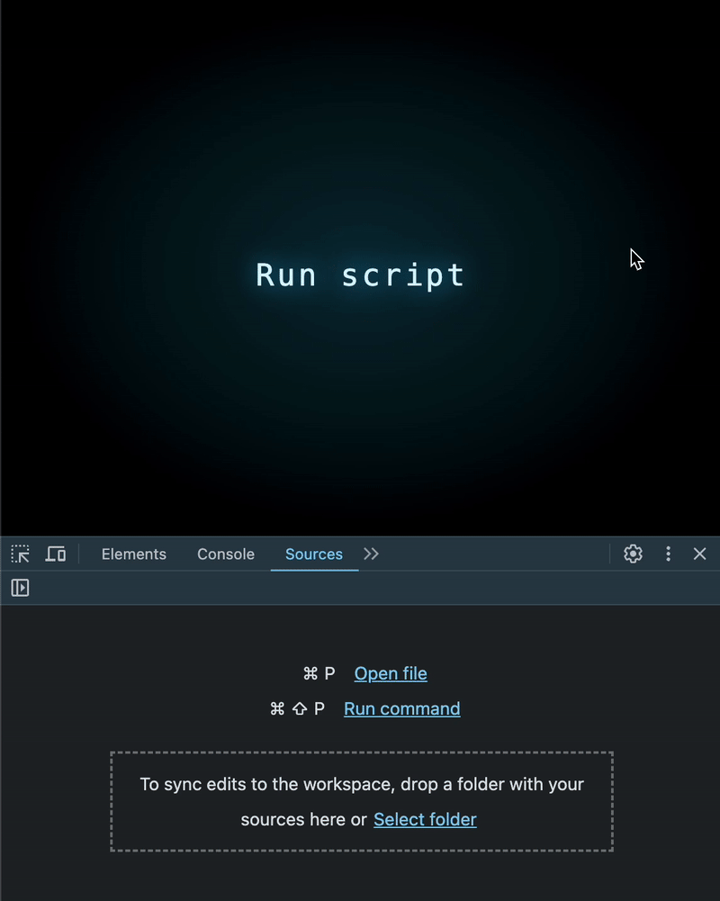
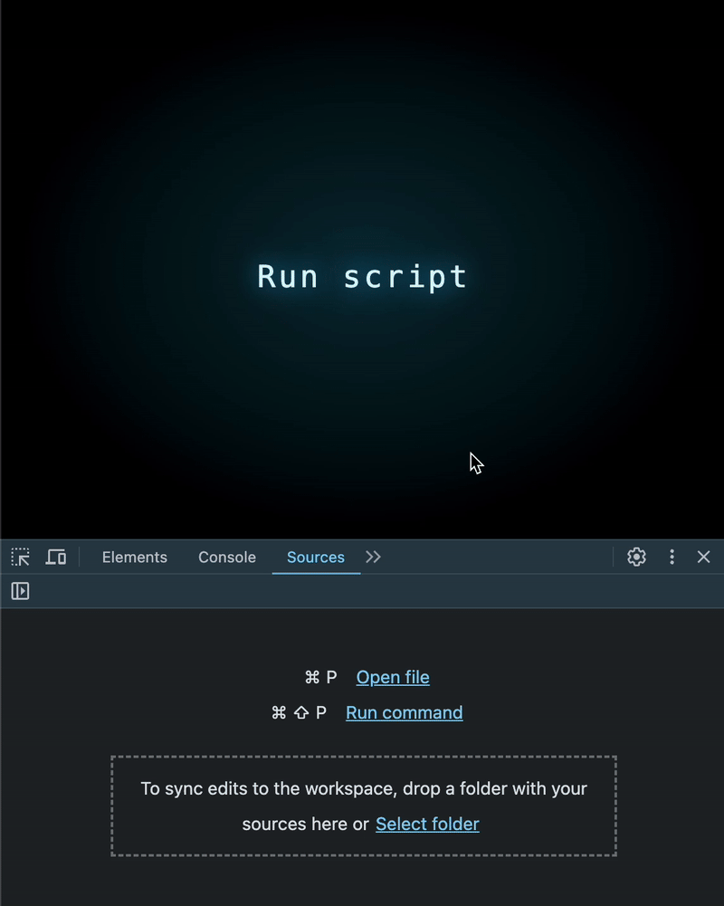

# JS Perf #2: The Dark Side of Formatting

When a simple formatting function becomes a silent performance killer


Not long ago, in the middle of the night, I was debugging a critical performance issue just before delivering a product to a client. I went deep into the code, fired up the Chrome DevTools Profiler, and after some digging, I found these innocent-looking lines of code:

```js
const formatOptions = { year: 'numeric', month: '2-digit', day: '2-digit' };
return dates.map(date => date.toLocaleString('en-US', formatOptions));
```

It looked fine at first glance, but in practice? It was painfully slow when tested on 200,000 items in a large dataset. The following example isolates the problematic code for clarity:


## The Prime Suspect: A Built-in JS Function?!

There was no doubt — the Chrome DevTools Profiler pointed straight at toLocaleString as the culprit. But wait… how? This is a native JavaScript function! It should be optimized, right? What was I missing?

After scouring the internet and coming up empty, I decided to take matters into my own hands.

## First Experiment: Call Intl.DateTimeFormat Directly

It’s well known that toLocaleString relies on the Intl API under the hood. As part of my first attempt to optimize, I wondered—what if I bypassed toLocaleString and used Intl directly?

```js
const formatOptions = { year: 'numeric', month: '2-digit', day: '2-digit' };
const formatter = new Intl.DateTimeFormat('en-US', formatOptions);
return dates.map(date => formatter.format(date));
```

To my surprise — this massively improved performance, even when tested on a million items!



## But Why Stop There? Can We Push It Even Further?

At this point, I had to wonder — what if I ditched Intl altogether and handled the formatting manually?

```js
return dates.map(date => {
    const year = date.getFullYear();
    const month = (date.getMonth() + 1).toString().padStart(2, '0');
    const day = date.getDate().toString().padStart(2, '0');

    return `${month}/${day}/${year}`;
});
```

The result? Even faster performance! 🚀



## What’s Really Going On Here?

toLocaleString seems like a no-brainer, but under the hood, it creates a new Intl instance on every call, leading to unnecessary processing overhead. The fix? Create a single Intl instance once and reuse it.

Beyond that, generic functions are always slower than specialized ones. Why? Because they need to support countless formats and options (and therefore, a lot of if’s), which adds significant processing overhead. Writing a function tailored to your exact needs will always be faster.

## The Same Performance Pitfall Exists Across All Intl Formatting

It’s not just about formatting dates — the same inefficiency applies to all Intl formatters, whether for numbers, currencies, or percentages. The issue stems from the fact that toLocaleString creates a new Intl instance every time it's called, making it highly inefficient for large datasets.

To illustrate this, let’s take a closer look at number formatting and compare different approaches:

```js
const slow = () => {
    return numbers.map(num => num.toLocaleString('en-US', { style: 'percent' }));
}

const faster = () => {
    const formatter = new Intl.NumberFormat('en-US', { style: 'percent' });
    return numbers.map(num => formatter.format(num));
}
    
const fastest = () => {
    return numbers.map(num => Math.round(num * 100) + '%');
}
```

Again, reusing an Intl.NumberFormat instance significantly reduces processing time. However, the fastest approach is bypassing Intl entirely and implementing custom formatting logic that caters to your needs.

## Takeaways: How to Handle Formatting in JavaScript Efficiently

1. If you’re working with large datasets, create a single Intl instance once and reuse it across all iterations.
2. If you can, avoid generic formatting functions and implement only what you actually need — this ensures maximum efficiency.
3. Always profile your code before assuming a built-in function is fast enough. Sometimes, they hide unexpected performance bottlenecks.

🚀 Remember: Readability is important, but blindly using generic functions can cost you serious performance!

## Original Text

[JS Perf #2: The Dark Side of Formatting](https://itnext.io/the-dark-side-of-formatting-in-js-23e6976122f7)
