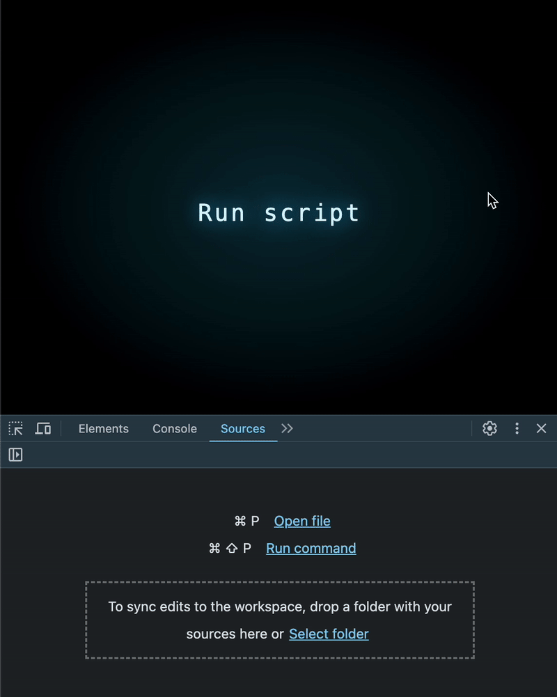

# JS性能优化<2>：格式化函数的性能陷阱

当简单格式化函数沦为隐蔽的性能杀手时


近日午夜时分，在向客户交付产品前夕，我正调试一个严重性能问题。我深入代码层，启动Chrome DevTools性能分析器。经过排查，发现了看似无害的这几行代码：

```js
const formatOptions = { year: 'numeric', month: '2-digit', day: '2-digit' };
return dates.map(date => date.toLocaleString('en-US', formatOptions));
```

乍看非常合理，但实测在处理200,000条数据项时却导致性能急剧下降。我们通过如下示例来隔离问题代码以便说明：


## 真凶竟是原生JS函数？

性能分析器明确指向toLocaleString方法——这竟是个内置JavaScript函数！本应高度优化的内置方法为何会导致性能问题？我究竟忽略了什么？

遍查资料无果后，我决定手动剖析问题根源。

## 实验一：直接调用Intl.DateTimeFormat

已知toLocaleString底层依赖国际化API（Intl）。在第一轮优化尝试中，我在想：若直接使用Intl.DateTimeFormat会是怎样的效果？

```js
const formatOptions = { year: 'numeric', month: '2-digit', day: '2-digit' };
const formatter = new Intl.DateTimeFormat('en-US', formatOptions);
return dates.map(date => formatter.format(date));
```

结果超出预期——即使在百万级数据量下，性能仍获得大幅提升！



## 但为何止步？还能继续优化吗？

此时我的思考已进入下一阶段——如果完全舍弃Intl模块改用自定义逻辑呢？

```js
return dates.map(date => {
    const year = date.getFullYear();
    const month = (date.getMonth() + 1).toString().padStart(2, '0');
    const day = date.getDate().toString().padStart(2, '0');

    return `${month}/${day}/${year}`;
});
```

最终结果显示——性能再创新高！🚀


## 底层原理剖析

表面易用的toLocaleString方法每次调用都会新建Intl实例，这使得处理过程产生不必要开销。解决方案十分简洁：创建单个Intl实例全局复用即可。

进一步而言，通用函数因其需支持多种格式选项（包含大量内部条件判断），执行效率必然低于专用函数。根据具体需求编写定制化函数通常是更优选择。

## Intl格式化模块存在共性性能缺陷

不仅是日期格式化，所有基于Intl的格式化工具（如数字/货币/百分比）都存在同样的性能问题。这一切都源于toLocaleString方法的底层机制——每次调用都会创建新的Intl实例。

为具体说明，我们来看数字格式化场景下不同实现方式的对比：

```js
const slow = () => {
    return numbers.map(num => num.toLocaleString('en-US', { style: 'percent' }));
}

const faster = () => {
    const formatter = new Intl.NumberFormat('en-US', { style: 'percent' });
    return numbers.map(num => formatter.format(num));
}
    
const fastest = () => {
    return numbers.map(num => Math.round(num * 100) + '%');
}
```

实验再次印证：复用Intl.NumberFormat实例能显著降低耗时。不过解决方案的终极形态依然是完全绕开Intl模块，根据需求实施定制化格式化逻辑。

## 核心建议：JavaScript高效格式化实践指南

1. 处理大数据集时，请预先创建单个Intl实例并全局复用
2. 尽可能弃用通用格式化函数，改为实现满足当前需求的最小功能集以保证最佳性能
3. 切忌想当然认为内置函数性能达标——代码性能剖析应是优化前的必要步骤，有些原生API可能潜藏性能陷阱

🚀 重要提示：代码可读性固然重要，但盲目使用通用函数可能带来严重的性能损耗！

## 原文链接

[JS Perf #2: The Dark Side of Formatting](https://itnext.io/the-dark-side-of-formatting-in-js-23e6976122f7)