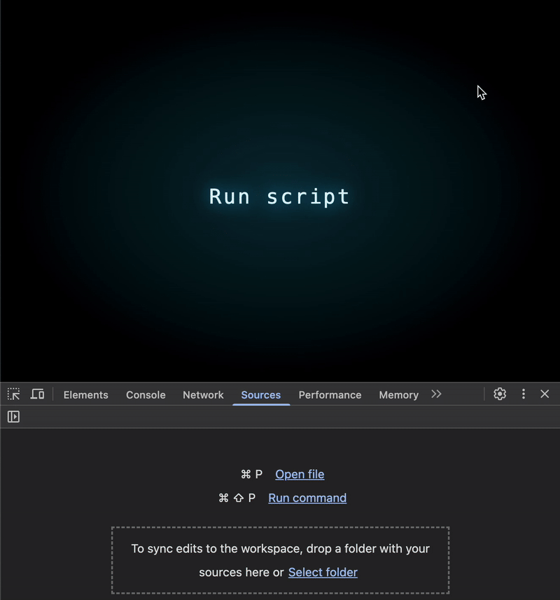
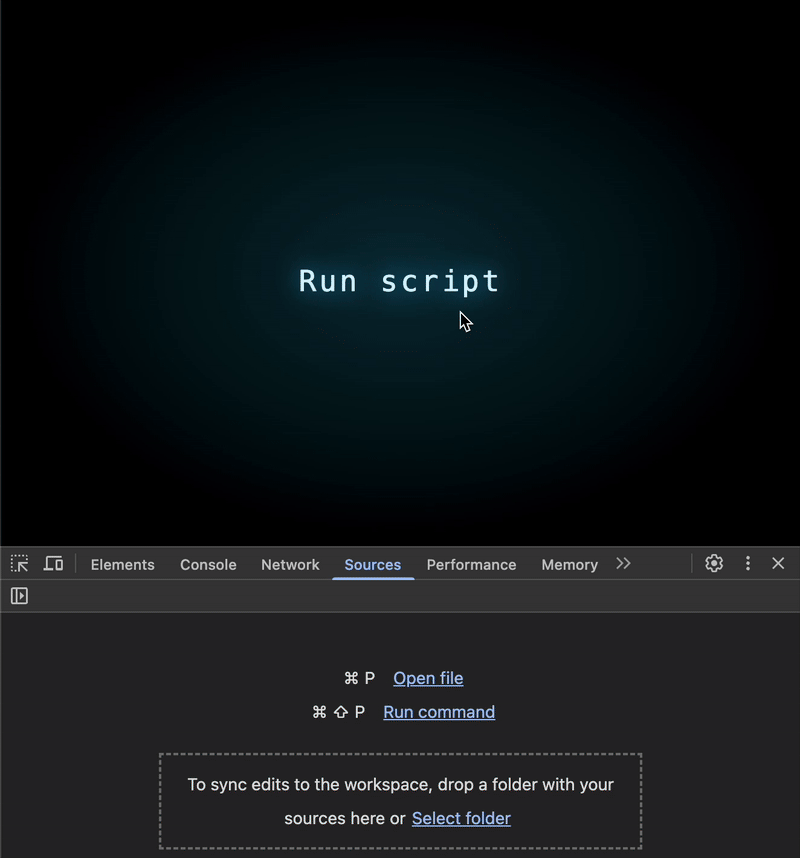

# JS Perf #3: Are you aware of this Regex pitfall?

Did you know that regular expressions can secretly slow your app down?


Regular expressions are a lifesaver for complex text processing, but did you know it can secretly slow your app down?

Imagine we have a large number of paragraphs, each 20K characters long, and every one of them starts with `foo` and ends with `bar`. Now, let’s say we want to verify that each paragraph follows this structure. The natural approach might be to write the following `Regex`:

```js
/^foo.*bar$/s.test(text)
```

At first glance, this works just fine, even for 10K paragraphs:



But what happens when we scale up? If we need to process a million paragraphs, the Regex check suddenly becomes painfully slow:


## How Can We Improve Performance?

Are we doomed to wait endlessly for this check to be completed? Absolutely not. We can solve this easily with the following code:

```js
text.startsWith('foo') && text.endsWith('bar')
```

The result? Even when running this on 50 million (!) paragraphs, it remains lightning-fast:


## Why Is `Regex` Slow Here?

The performance difference makes perfect sense once we understand what’s happening under the hood. In the Regex we wrote earlier, the engine performs three separate checks:

1. ^foo - Ensures the string starts with foo.
2. bar$ - Ensures the string ends with bar.
3. .* and the flag s - Ensures that every character between foo and bar is, well... some character 😂. Clearly, that's where the real problem lies!
   
The issue is that .* forces the Regex engine to iterate through every character in the string, even though there’s no real need to do so. This results in an O(n) runtime per paragraph—scaling up quickly into a severe performance bottleneck.

By contrast, startsWith and endsWith don’t require scanning the entire string. They perform a simple index lookup at the beginning and end, avoiding the overhead of regex processing.

## Do we really have to give up on `Regex`?

It might seem like startsWith and endsWith are just sugar syntax since you can seemingly achieve the exact same result like this:

```js
/^foo/.test(text) && /bar$/.test(text)
```

While it looks identical, benchmarking shows that with a high number of iterations — 50 million in this case — it’s nearly 5 times slower:



So, the unavoidable conclusion is that Regex doesn’t provide the best performance, and when dealing with large amounts of data or operations, it’s worth considering an alternative like the one we suggested.

Besides, let’s be honest — using functions like startsWith and endsWith is way more readable and elegant, right? 😉

## Another Example: Checking for a Substrings Near the Edges

Here’s another useful function that simplifies processes. Suppose we need to check if foo appears somewhere within the first 12 characters and bar appears somewhere within the last 12 characters of a string. Using Regex, it would look like this:

```js
/^(?=.{0,9}foo).*bar(?=.{0,9}$)/s.test(text)
```

And again, bad results:


At this point, it looks like startsWith and endsWith won’t be of much help since we’re not looking for something that appears exactly at the beginning or end of the string. However, we can use other functions to simplify this considerably into something much more readable and significantly faster:

```js
text.substring(0, 12).includes('foo') &&
text.includes('bar', text.length - 12)
```

And even when we test it with 100 million iterations (!) it runs seamlessly:


It might seem that using substring, which essentially creates a new array on each iteration, is more expensive than Regex, but that’s a mistake! This operation is actually much cheaper and will give us the exact same check with almost negligible runtime overhead!

(Of course, we could implement the search ourselves using a loop over the string up to position 12 rather than using substring, but the marginal improvement we’d gain here isn’t worth the cumbersome and unreadable code you’d have to maintain.)

## Are there more examples?

Absolutely. You can measure this example and see that with a large amount of data, the runtime differences are significant:

```js
// Slow 👎
text.replace(/^\s+|\s+$/g, '')

// Fast 👍
text.trim()
```

Here’s another one:

```js
// Slow 👎
text.replace(/foo/g, 'bar');

// Fast 👍
text.split('foo').join('bar');
```

## Conclusion

As always, built-in language features are powerful, but they require a solid understanding to use them efficiently. Careless or uninformed usage can lead to serious performance pitfalls. By understanding how things work under the hood, we can write faster, cleaner, and more efficient code.

Regex is a potent tool—let’s use it wisely!

## Original Text

[JS Perf #3: Are you aware of this Regex pitfall?](https://itnext.io/js-perf-3-are-you-aware-of-this-regex-pitfall-47bd3f326655)
