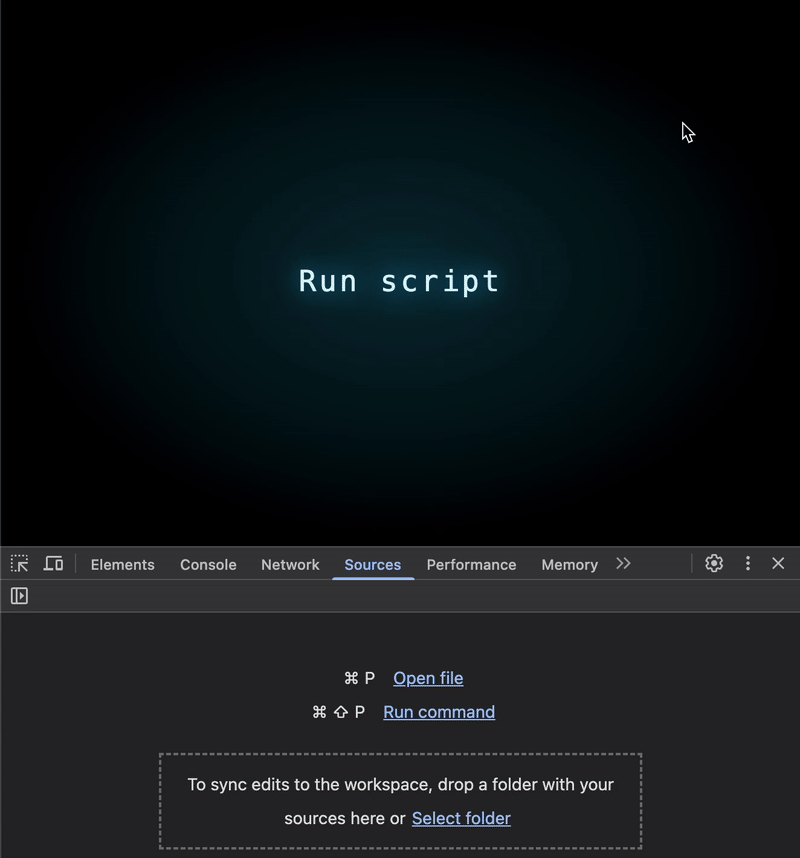
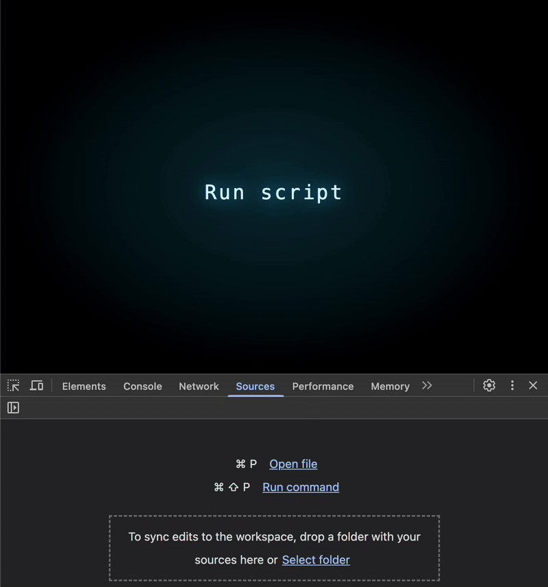
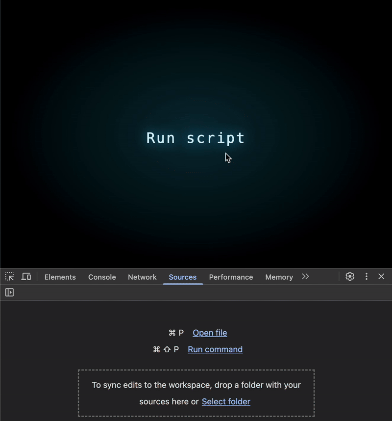
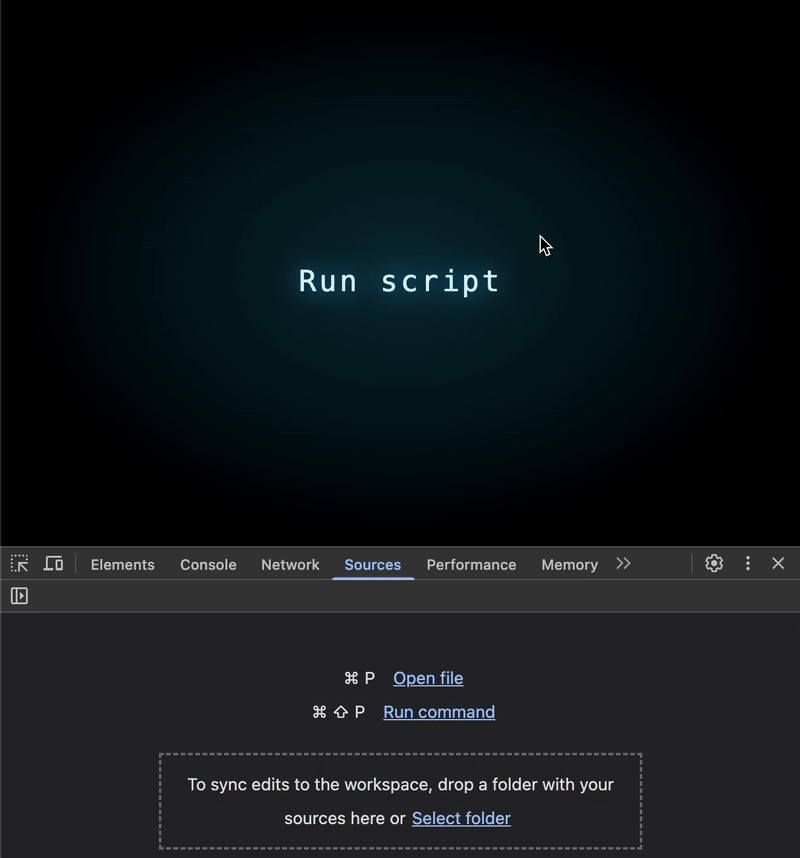

# JS性能优化<3>：您注意过这个正则表达式陷阱吗？

您是否意识到正则表达式可能暗中拖慢应用速度？


正则表达式在处理复杂文本时堪称救星，但您是否注意到它可能暗中降低应用性能？

假设我们有大量段落需要处理，每个段落长达2万字符，且均以`foo`开头、`bar`结尾。现要求验证段落结构是否符合该模式，直观的解决方案可能是编写如下正则表达式：

```js
/^foo.*bar$/s.test(text)
```

初步测试显示，即使处理1万段落时该正则仍能正常工作：



但当规模扩大至一百万段落时，正则检查性能会急剧下降：


## 如何提升性能？

我们只能束手等待漫长的检查过程吗？当然不！以下代码可轻松解决问题：

```js
text.startsWith('foo') && text.endsWith('bar')
```

结果显示，即使在处理5千万（！）段落时，该方法依旧表现出闪电般的速度：



## 为何正则表达式如此缓慢？

透过现象看本质，我们将理解这种性能差异的成因。上述正则表达式实际上执行了三个独立检测步骤：

1. ^foo —— 确保字符串以foo开头
2. bar$ —— 确保字符串以bar结尾
3. .*与点号全匹配标志s —— 确保foo与bar之间包含任意字符。😂 显然，这步操作是性能问题的元凶！

症结在于：.*操作会强制正则引擎遍历每个字符，而实际并无此必要。这将导致单段落处理时间复杂度高达O(n)，形成严重性能瓶颈。

反观startsWith与endsWith方法，它们仅需对首尾进行直接索引检查，完全规避了正则处理的开销。

## 必须完全放弃正则表达式吗？

表面上看起来，startsWith和endsWith只是语法糖，因为以下方法似乎能达到相同的效果：

```js
/^foo/.test(text) && /bar$/.test(text)
```

然而基准测试显示，在处理高达5千万次迭代时，该方法的性能会下降近5倍：



由此可知，正则表达式并非最佳性能选择。在处理海量数据或高频操作时，我们应该优先考虑前文提出的替代方案。

再者，坦诚而言 —— 使用startsWith和endsWith这种内置方法，代码可读性和优雅程度都更胜一筹，不是吗？😉

## 另一个示例：首尾区间子串检测

另一个实用案例是子串定位检查。假设需要验证字符串是否在前12个字符内包含foo，且最后12个字符内包含bar。使用正则的解决方案如下：

```js
/^(?=.{0,9}foo).*bar(?=.{0,9}$)/s.test(text)
```

其执行结果仍不理想：


此时，单纯依赖startsWith和endsWith显然无法满足需求。通过合理组合其他内置方法，我们可以获得更高效且可读的解决方案：

```js
text.substring(0, 12).includes('foo') &&
text.includes('bar', text.length - 12)
```

即使在1亿次迭代测试中，该方法依然游刃有余：



虽然每次迭代时substring都会创建新数组，但这看似会带来更高开销。实际情况恰恰相反！该操作的成本远低于正则处理，且运行时开销几乎可忽略不计。

(当然，我们可通过手动编写循环在首12个字符内搜索子串来提升性能，但由此产生的代码可维护性下降与其带来的微乎其微的优化相比，实非明智之选)

## 是否还有更多案例？

当然。以下案例可证明数据量越大，运行时差异越显著：

```js
// Slow 👎
text.replace(/^\s+|\s+$/g, '')

// Fast 👍
text.trim()
```

另一个典型示例如下：

```js
// Slow 👎
text.replace(/foo/g, 'bar');

// Fast 👍
text.split('foo').join('bar');
```

## 关键结论

内在逻辑始终是效率之本：语言内置功能虽强大，但需深入理解其机制才能恰当使用。草率的选择往往导致严重性能问题。通过理解底层原理，我们能够编写更快、更简洁、更高效的代码。

正则表达式是把利器 —— 但请务必谨慎使用！

## 原文链接

[JS Perf #3: Are you aware of this Regex pitfall?](https://itnext.io/js-perf-3-are-you-aware-of-this-regex-pitfall-47bd3f326655)