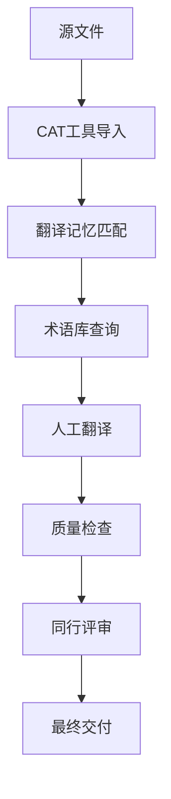

# 翻译工具

本章节介绍各种翻译工具，帮助译者选择合适的工具来提高翻译效率和质量。

## 工具分类

### 1. CAT 工具 (Computer-Assisted Translation)
CAT 工具是专业翻译的核心工具，提供翻译记忆、术语管理、质量检查等功能。

### 2. 术语管理工具
用于建立和维护术语库，确保翻译的一致性。

### 3. 质量检查工具
自动检测翻译中的错误和不一致之处。

### 4. 协作平台
支持团队协作翻译的在线平台。

### 5. 辅助工具
提高翻译效率的各种辅助软件。

## 推荐工具列表

### CAT 工具

#### 1. SDL Trados Studio
**类型**: 商业软件  
**价格**: 付费  
**适用场景**: 专业翻译公司、大型项目

**主要功能**:
- 强大的翻译记忆功能
- 完善的术语管理
- 多种文件格式支持
- 质量检查和统计
- 项目管理功能

**优点**:
- 行业标准，兼容性好
- 功能全面，专业性强
- 大量插件和扩展

**缺点**:
- 价格昂贵
- 学习曲线陡峭
- 界面复杂

#### 2. MemoQ
**类型**: 商业软件  
**价格**: 付费  
**适用场景**: 中小型翻译团队

**主要功能**:
- 直观的用户界面
- 实时协作功能
- 内置质量检查
- 灵活的工作流程

**优点**:
- 界面友好，易于学习
- 协作功能强大
- 性价比较高

**缺点**:
- 市场占有率较低
- 某些高级功能不如 Trados

#### 3. OmegaT
**类型**: 开源软件  
**价格**: 免费  
**适用场景**: 个人译者、小型项目

**主要功能**:
- 基本的 CAT 功能
- 支持多种文件格式
- 可自定义和扩展
- 跨平台支持

**优点**:
- 完全免费
- 开源可定制
- 轻量级

**缺点**:
- 功能相对简单
- 界面较为朴素
- 技术支持有限

### 术语管理工具

#### 1. MultiTerm (SDL)
**类型**: 商业软件  
**价格**: 付费（通常与 Trados 捆绑）

**功能**:
- 专业术语库管理
- 多语言术语支持
- 与 Trados 无缝集成
- 术语提取和验证

#### 2. Notion
**类型**: 在线协作平台  
**价格**: 免费/付费

**功能**:
- 灵活的数据库功能
- 团队协作
- 模板和自动化
- 多媒体支持

**术语库模板**:
```markdown
# 技术术语库

## 前端开发
| 英文 | 中文 | 备注 |
|------|------|------|
| Component | 组件 | React/Vue 概念 |
| Hook | 钩子 | React 16.8+ |
| State | 状态 | 组件状态 |
```

#### 3. Airtable
**类型**: 在线数据库  
**价格**: 免费/付费

**功能**:
- 类似 Excel 的界面
- 强大的筛选和排序
- API 集成
- 团队协作

### 质量检查工具

#### 1. Xbench
**类型**: 独立软件  
**价格**: 免费/付费

**功能**:
- 术语一致性检查
- 翻译记忆质量检查
- 拼写和语法检查
- 数字和标点检查

#### 2. ApSIC Xbench
**类型**: 质量检查工具  
**价格**: 付费

**功能**:
- 高级质量检查
- 自定义检查规则
- 批量处理
- 详细报告

### 协作平台

#### 1. Crowdin
**类型**: 云端翻译平台  
**价格**: 免费/付费

**功能**:
- 在线翻译编辑器
- 实时协作
- 版本控制集成
- 自动化工作流
- 翻译记忆和术语库

**适用场景**:
- 软件本地化
- 文档翻译
- 网站翻译

#### 2. Lokalise
**类型**: 云端翻译平台  
**价格**: 付费

**功能**:
- 开发者友好的 API
- 与开发工具集成
- 自动化翻译工作流
- 实时预览

#### 3. Phrase
**类型**: 云端翻译平台  
**价格**: 付费

**功能**:
- 企业级翻译管理
- 高级工作流程
- 集成开发环境
- 详细的分析报告

### 辅助工具

#### 1. 文本编辑器

**VS Code**
- 多语言支持
- 丰富的插件生态
- Git 集成
- 实时预览

**推荐插件**:
- Chinese (Simplified) Language Pack
- Markdown All in One
- Code Spell Checker
- GitLens

**Sublime Text**
- 轻量快速
- 强大的搜索替换
- 多光标编辑
- 丰富的插件

#### 2. 版本控制

**Git**
- 版本历史追踪
- 分支管理
- 协作开发
- 冲突解决

**基本工作流**:
```bash
# 克隆项目
git clone <repository-url>

# 创建翻译分支
git checkout -b translation/zh-cn

# 提交翻译
git add .
git commit -m "Add Chinese translation"

# 推送到远程
git push origin translation/zh-cn
```

#### 3. 截图和标注工具

**Snagit**
- 屏幕截图
- 图像编辑
- 标注功能
- 批量处理

**LICEcap**
- GIF 录制
- 轻量级
- 免费开源

#### 4. 参考工具

**在线词典**
- 有道词典
- 金山词霸
- Cambridge Dictionary
- Merriam-Webster

**技术文档**
- MDN Web Docs
- Stack Overflow
- GitHub
- 官方技术文档

## 工具选择指南

### 个人译者

**预算有限**:
- CAT 工具: OmegaT
- 术语管理: Notion/Excel
- 编辑器: VS Code
- 版本控制: Git

**预算充足**:
- CAT 工具: MemoQ
- 术语管理: MultiTerm
- 质量检查: Xbench
- 编辑器: VS Code

### 小型团队

**推荐配置**:
- 协作平台: Crowdin
- CAT 工具: MemoQ
- 术语管理: Airtable
- 版本控制: Git
- 沟通工具: Slack/Teams

### 大型企业

**推荐配置**:
- CAT 工具: SDL Trados Studio
- 协作平台: Phrase
- 术语管理: MultiTerm
- 质量检查: ApSIC Xbench
- 项目管理: Jira

## 工具集成

### 工作流程自动化



### API 集成示例

**Crowdin API 使用**:
```javascript
// 上传文件到 Crowdin
const crowdin = require('@crowdin/crowdin-api-client');

const { translationsApi } = new crowdin({
  token: 'your-api-token'
});

// 上传翻译文件
translationsApi.uploadTranslations(projectId, {
  storageId: fileId,
  fileId: sourceFileId
});
```

## 最佳实践

### 1. 工具配置
- 统一团队工具配置
- 建立标准模板
- 定期备份数据
- 保持工具更新

### 2. 数据管理
- 定期备份翻译记忆
- 维护术语库质量
- 版本控制管理
- 安全性考虑

### 3. 团队协作
- 建立工作流程
- 定义角色权限
- 沟通协调机制
- 知识分享

### 4. 持续改进
- 定期评估工具效果
- 收集用户反馈
- 优化工作流程
- 学习新技术

---

选择合适的翻译工具是提高翻译效率和质量的关键。根据项目需求、团队规模和预算情况，合理配置工具组合，建立高效的翻译工作流程。